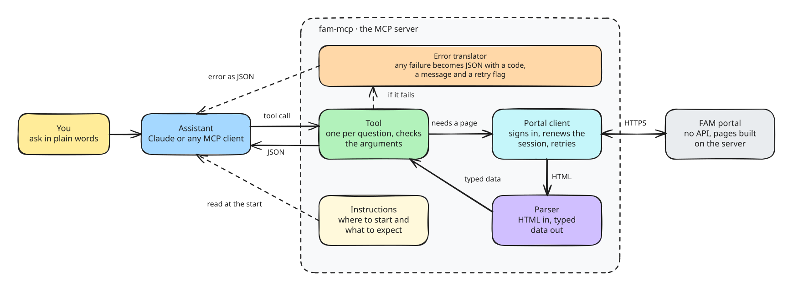

<h1 align="center">🎓 fam-mcp</h1>

<br>

<h3 align="center">An MCP server for the FAM student portal.<br>It reads the portal so an assistant can answer what the portal makes you click for</h3>

<p align="center">
    <a href="https://github.com/Petri-Hub/fam-mcp/commits/main"></a> 
</p>

<br>

## About

> **TL;DR:** a read-only MCP server that gives an AI assistant access to a student's data on the portal of FAM (Faculdade de Americana): grades, absences, assignments, schedule, exams, inbox, forums, finances and complementary hours. The portal has no API, so the server signs in as the student, reads the pages and hands back clean, typed JSON. It does not write anything back.

## Why it exists

The portal does its job, but it was built for a browser and a patient person. There is no API, every screen is a full page rendered on the server that takes seconds to load, and the answer to a simple question is usually spread over several of them. *What do I have to deliver this week?* means the assignments, the forums, the exam calendar and the finance page.

With this server the assistant opens those pages for me, and I just ask. Some things I use it for:

- *"What is due this week?"* reads the assignments, exams, forums and invoices in one go
- *"Can I still miss class in this course?"* checks the absences against the allowed maximum
- *"What do I need on the last exam to pass?"* reads the averages together with the portal's own grading rules
- *"How much of the degree is left?"* adds up the transcript

## How it works

<p align="center">
  
</p>

Every tool is a small module. It asks the portal client for one or more pages, parses the HTML into a typed model, and returns it. The portal client keeps a single session for the whole run: it signs in when the server starts, notices when the portal sends it back to the login page, signs in again once and retries the request. Calls that arrive together share that one login.

## What it can do

### Student

| Tools | What they do |
|---|---|
| `get_student_profile` | Who is signed in: name, RA, class, term and masked contact data |

### Academics

| Tools | What they do |
|---|---|
| `list_courses`<br>`get_class_schedule`<br>`get_grades`<br>`get_term_results`<br>`get_absences`<br>`get_transcript`<br>`get_degree_progress`<br>`get_exam_calendar` | The courses of a term, with teachers and teaching-plan status<br>What happens on each weekday<br>Scores per evaluation stage: N1, N2 and N3<br>Averages, grading rules and the absences used so far<br>How many classes can still be missed, month by month<br>The full grade history, semester by semester<br>How much of the degree is done and what comes next<br>When the exams are |

### Assignments

| Tools | What they do |
|---|---|
| `list_activities`<br>`get_activity`<br>`download_activity_material`<br>`get_agenda` | Assignments with deadline, status and whether they were delivered<br>One assignment in full: instructions, materials and the delivery<br>Saves an attached file so the assistant can read it<br>Everything with a date in the next days, in one sorted list |

### Communication

| Tools | What they do |
|---|---|
| `get_inbox`<br>`get_inbox_mail`<br>`list_forums`<br>`get_forum`<br>`list_surveys` | Inbox messages, filtered by unread or sender<br>One message in full, with its attachments<br>The course forums and whether they are still open<br>A forum's instructions and replies<br>The institutional surveys and which ones were answered |

### Finance and requests

| Tools | What they do |
|---|---|
| `get_financial_status`<br>`list_requests`<br>`get_complementary_hours` | Open invoices, with the bank data to check them against<br>The requests opened at the secretariat<br>Complementary activity hours, by status |

## Philosophy

**Read-only, always.**  
It never submits, posts or answers anything on the portal. The only side effect comes from the portal itself: opening a message in the inbox marks it as read.

**Questions, not screens.**  
The tools follow what a student actually asks, not how the portal's menu is organized. One question about what's coming up replaces four pages, and finding out how far along the degree is replaces adding up a transcript by hand.

**Private by default.**  
Personal documents like the CPF and the RG come back hidden, other students' names and registration numbers are removed from forum replies, and the login stays in the environment instead of showing up in any answer.

**Failures that explain themselves.**  
When something goes wrong, the assistant gets a clear answer: what happened, whether trying again makes sense and which tool it was. A portal that is down is told apart from a page that changed its layout, and the technical details stay in the log instead of reaching the assistant.

**Gentle with a fragile site.**  
There is one shared session, renewed only when it expires. A call takes from a few seconds to about twenty, and doing several at once barely helps. The server doesn't hide that, and tells the assistant up front.

**Shaped for the assistant.**  
Dates and numbers always come in the same format, and every id the assistant needs comes from a previous answer. The server also says where to start, so the assistant spends its calls on the answer instead of finding its way around.

## What's inside

```sh
├── assets/             # the How it works diagram, as an editable Excalidraw file and its SVG
├── src/fam_mcp
│   ├── server.py       # the MCP server: instructions, middleware and the login at startup
│   ├── portal.py       # the session with the portal: login, re-login, retries, decoding
│   ├── middleware.py   # turns every failure into the JSON error
│   ├── errors.py       # the error hierarchy, one class per failure
│   ├── constants.py    # the error codes and their messages
│   ├── utils.py        # parsing helpers: dates, numbers, masking
│   ├── data/           # what the tools return, as dataclasses, one module per area
│   └── tools/          # one file per tool, registered automatically on import
└── pyproject.toml
```

## Technologies

| &nbsp;&nbsp;&nbsp;&nbsp;&nbsp; | Technology | Used for |
|:---:|---|---|
|  | [Model Context Protocol](https://modelcontextprotocol.io) | The protocol that lets an assistant call the tools |
|  | [FastMCP](https://gofastmcp.com) | The MCP framework: tool registration, input validation, middleware and the startup lifecycle |
|  | [Python](https://docs.python.org/3/) | The language, with `asyncio` so calls don't block each other |
|  | [httpx](https://www.python-httpx.org) | The async HTTP client behind the portal session |
|  | [Beautiful Soup](https://www.crummy.com/software/BeautifulSoup/bs4/doc/) | Reads the portal's HTML, which is often malformed |
|  | [uv](https://docs.astral.sh/uv/) | Dependencies and running the project |

## Roadmap

What's already in place:

- ✅ A portal client that signs in, survives an expired session and shares one login between parallel calls
- ✅ 21 read-only tools across the student's profile, academics, assignments, communication and finances
- ✅ Errors as JSON with a code, a retryable flag and the tool that raised them
- ✅ Masked personal data, and forum replies stripped of other students' identifiers
- ✅ Every tool checked against the live portal, including its error cases
- ✅ Server instructions that tell the assistant where to start

What's not there yet:

- ⬜ Sent mail: the portal counts the messages but never renders them
- ⬜ Paid invoices: the portal seems to keep them behind a separate button the server doesn't use yet
- ⬜ Posted scores and pending requests: their parsers haven't met real data yet
- ⬜ A public release, with installation instructions

## References

- [Model Context Protocol](https://modelcontextprotocol.io): the specification the server speaks
- [FastMCP](https://gofastmcp.com): the framework the server is built on
- [httpx](https://www.python-httpx.org): the HTTP client
- [Beautiful Soup](https://www.crummy.com/software/BeautifulSoup/bs4/doc/): the HTML parser
- [uv](https://docs.astral.sh/uv/): how the project is run
- [FAM](https://www.famportal.com.br): the portal this server reads

## Disclaimer

This project is unofficial. It is not made by, affiliated with or endorsed by FAM.

## License

MIT, in [`LICENSE.md`](LICENSE.md).
