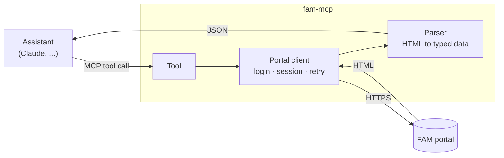

<h1 align="center">🎓 fam-mcp</h1>

<br>

<h3 align="center">An MCP server for the FAM student portal.<br>It reads the portal so an assistant can answer what the portal makes you click for</h3>

<p align="center">
    <a href="https://github.com/Petri-Hub/fam-mcp/commits/main"></a> 
</p>

<br>

## About

> **TL;DR:** a read-only [MCP](https://modelcontextprotocol.io) server that gives an AI assistant access to a student's data on the portal of FAM (Faculdade de Americana): grades, absences, assignments, schedule, exams, inbox, forums, finances and complementary hours. The portal has no API, so the server signs in as the student, reads the pages and hands back clean, typed JSON. It does not write anything back.

> **Unofficial.** This project is not made by, affiliated with or endorsed by FAM.

## Why it exists

The portal does its job, but it was built for a browser and a patient person. There is no API, every screen is a full page rendered on the server that takes seconds to load, and the answer to a simple question is usually spread over several of them. *What do I have to deliver this week?* means the assignments, the forums, the exam calendar and the finance page.

With this server the assistant opens those pages for me, and I just ask. Some things I use it for:

- *"What is due this week?"* reads the assignments, exams, forums and invoices in one go
- *"Can I still miss class in this course?"* checks the absences against the allowed maximum
- *"What do I need on the last exam to pass?"* reads the averages together with the portal's own grading rules
- *"How much of the degree is left?"* adds up the transcript

## How it works



Every tool is a small module. It asks the portal client for one or more pages, parses the HTML into a typed model, and returns it. The portal client keeps a single session for the whole run: it signs in when the server starts, notices when the portal sends it back to the login page, signs in again once and retries the request. Calls that arrive together share that one login.

## What it can do

| Area | Tool | Answers |
|---|---|---|
| **Student** | `get_student_profile` | Who is signed in: name, RA, class, term and contact data, with documents masked |
| **Academics** | `list_courses` | The courses of a term, with teachers and teaching-plan status |
| | `get_class_schedule` | What happens on each weekday |
| | `get_grades` | Scores per evaluation stage (N1, N2, N3) |
| | `get_term_results` | Where I stand: averages, the grading rules and the absences used |
| | `get_absences` | How many classes I can still miss, month by month |
| | `get_transcript` | The full grade history, semester by semester |
| | `get_degree_progress` | How much of the degree is done, and what comes next |
| | `get_exam_calendar` | When the exams are |
| **Assignments** | `list_activities` | The assignments, with deadline, status and whether I delivered |
| | `get_activity` | One assignment in full: instructions, materials, my delivery and grade |
| | `download_activity_material` | An attached file, saved locally so the assistant can read it |
| | `get_agenda` | Everything with a date in the next N days, in one sorted list |
| **Communication** | `get_inbox` | Inbox messages, with filters for unread and sender |
| | `get_inbox_mail` | One message in full, with its attachments |
| | `list_forums` | The course forums and whether they are still open |
| | `get_forum` | A forum's instructions and replies |
| | `list_surveys` | The institutional surveys and which ones I answered |
| **Finance and requests** | `get_financial_status` | Open invoices, with the bank data to check them against |
| | `list_requests` | The requests I opened at the secretariat |
| | `get_complementary_hours` | Complementary activity hours, by status |

## Philosophy

**Read-only, always.**  
Nothing is submitted, posted or answered on the portal. The one side effect belongs to the portal itself: opening a message with `get_inbox_mail` marks it as read.

**Questions, not screens.**  
The tools follow what a student asks, not the portal's menu. One `get_agenda` replaces four pages, and `get_degree_progress` adds up a transcript nobody wants to add up by hand.

**Private by default.**  
CPF, RG and phone come back masked, other students' names and RAs are stripped from forum replies, and the credentials live in the environment, never in a response.

**Failures that explain themselves.**  
Every error is JSON with a code, a message, a `retryable` flag and the tool that raised it. *The portal is down* (try again) is told apart from *the page layout changed* (don't), and the real cause stays in the log instead of reaching the model.

**Gentle with a fragile site.**  
One session shared by every call, renewed only when it expires. A call takes from a few seconds to about twenty, and running calls in parallel barely helps. The server doesn't try to hide that, and says so to the assistant in its instructions.

**Shaped for the model.**  
Dates are ISO 8601, grades are numbers or `null`, and ids always come from a previous tool's output. The server tells the assistant where to start, so it spends its calls on the answer and not on finding its way around.

## What's inside

```sh
├── src/fam_mcp
│   ├── server.py       # the MCP server: instructions, middleware and the login at startup
│   ├── portal.py       # the session with the portal: login, re-login, retries, decoding
│   ├── middleware.py   # turns every failure into the JSON error
│   ├── errors.py       # the error hierarchy, one class per failure
│   ├── constants.py    # the error codes and their messages
│   ├── utils.py        # parsing helpers: dates, numbers, masking
│   ├── data/           # what the tools return, as dataclasses, one module per area
│   └── tools/          # one file per tool, registered automatically on import
└── pyproject.toml
```

## Technologies

| &nbsp;&nbsp;&nbsp;&nbsp;&nbsp; | Technology | Used for |
|:---:|---|---|
|  | [Model Context Protocol](https://modelcontextprotocol.io) | The protocol that lets an assistant call the tools |
| | [FastMCP](https://gofastmcp.com) | The MCP framework: tool registration, input validation, middleware and the startup lifecycle |
|  | [Python](https://docs.python.org/3/) | The language, with `asyncio` so calls don't block each other |
| | [httpx](https://www.python-httpx.org) | The async HTTP client behind the portal session |
| | [Beautiful Soup](https://www.crummy.com/software/BeautifulSoup/bs4/doc/) | Reads the portal's HTML, which is often malformed |
|  | [uv](https://docs.astral.sh/uv/) | Dependencies and running the project |

## Roadmap

What's already in place:

- ✅ A portal client that signs in, survives an expired session and shares one login between parallel calls
- ✅ 21 read-only tools across the student's profile, academics, assignments, communication and finances
- ✅ Errors as JSON with a code, a retryable flag and the tool that raised them
- ✅ Masked personal data, and forum replies stripped of other students' identifiers
- ✅ Every tool checked against the live portal, including its error cases
- ✅ Server instructions that tell the assistant where to start

What's not there yet:

- ⬜ Sent mail: the portal counts the messages but never renders them
- ⬜ Paid invoices: the portal seems to keep them behind a separate button the server doesn't use yet
- ⬜ Posted scores and pending requests: their parsers haven't met real data yet
- ⬜ A public release, with installation instructions

## References

- [Model Context Protocol](https://modelcontextprotocol.io): the specification the server speaks
- [FastMCP](https://gofastmcp.com): the framework the server is built on
- [httpx](https://www.python-httpx.org): the HTTP client
- [Beautiful Soup](https://www.crummy.com/software/BeautifulSoup/bs4/doc/): the HTML parser
- [uv](https://docs.astral.sh/uv/): how the project is run
- [FAM](https://www.famportal.com.br): the portal this server reads

## License

MIT, in [`LICENSE.md`](LICENSE.md).
